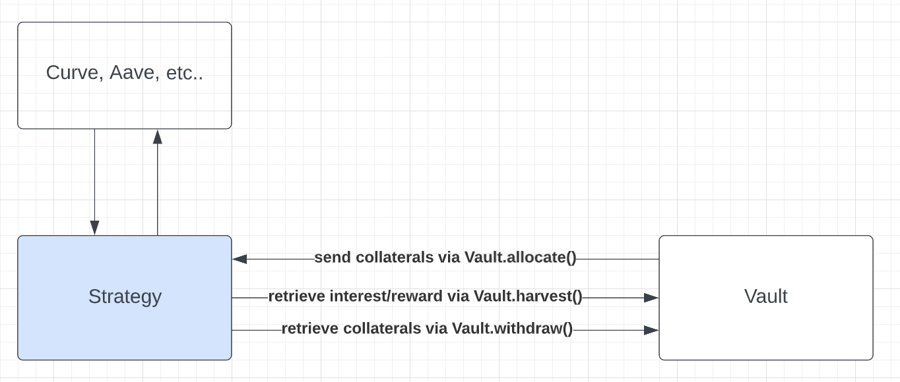

# Objective
Participants' objective is to develop a strategy contract that is capable of taking collaterals from the Vault (Vault.allocate()), depositing it into an strategy and accumulating interest and reward. Vault can retrieve the interest and reward (via harvest()), as well as the collateral (via withdraw())

We provide a minimized version of Vault in another repo: https://github.com/Sperax/Hackathon-Vault

# Flow

